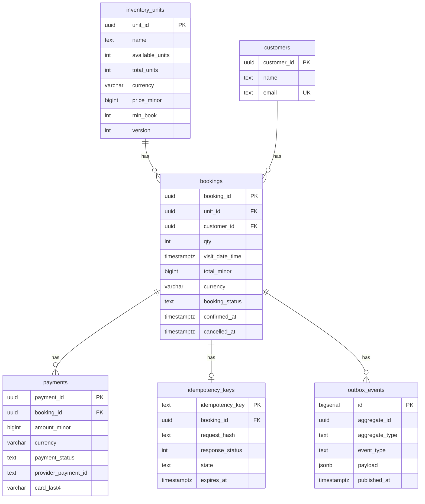

# Loka

A booking service for perishable inventory — rooms, cabins, seats. It exists to
answer one question properly: **what actually prevents overselling when hundreds
of requests contend for the last unit?**

Go · PostgreSQL · k6

---

## The finding

I expected the naive implementation to oversell. It did not, and the reason is
more interesting than the failure would have been.

500 concurrent requests against a 10-seat unit. Identical code paths. One line of
SQL different.

| Decrement | Bookings | `available_units` | Invariant | Overbooked |
|---|---|---|---|---|
| `SET available_units = available_units - $1` | **10** | 0 | 0 + 10 = 10 ✓ | 0 |
| `SET available_units = $1` (computed in Go) | **500** | 8 | 8 + 500 = 508 ✗ | **490** |

The first version is correct because the subtraction happens **inside** a single
statement. Postgres holds a row lock for its duration and evaluates
`available_units - $1` against the current committed value — not against whatever
the application read moments earlier. Fifty requests that all read
`available_units = 10` still produce 10, 9, 8 … because each subtraction operates
on fresh state. The eleventh attempt is rejected by `CHECK (available_units >= 0)`
and becomes a 409.

The second version trusts the stale read. Every request computes `10 - 1 = 9` and
writes `9` absolutely. Fifty requests writing 9 have the same effect as one, and
the final value reflects only whichever write landed last.

The sharpest part: **`chk_availability` fired 490 times in the safe run and zero
times in the unsafe one.** A value that is out of date but written absolutely
stays within legal bounds, so the constraint has nothing to reject. A database
constraint can only defend an invariant the database is able to evaluate.

Full measurements, including the environment caveats, are in
[`docs/metrics.md`](docs/metrics.md).

---

## Run it

Requires Docker, Go 1.24+, and [`golang-migrate`](https://github.com/golang-migrate/migrate).

```bash
make reset    # fresh database, migrations, seed data
make run
```

```bash
curl -i -X POST localhost:8080/bookings \
  -H 'Content-Type: application/json' \
  -H 'Idempotency-Key: my-first-booking' \
  -d '{
    "unit_id": "22222222-2222-2222-2222-222222222222",
    "customer_id": "11111111-1111-1111-1111-111111111111",
    "qty": 1,
    "visit_date_time": "2026-10-01T10:00:00Z"
  }'
```

```
HTTP/1.1 201 Created

{"booking_id":"6d364420-…","qty":1,"total_minor":150000000,
 "currency":"IDR","status":"pending", …}
```

Send it again with the same `Idempotency-Key` and you get **200** with
`Idempotent-Replay: true` and the same booking id. Availability drops by one, not
two.

### Reproduce the measurements

```bash
k6 run scripts/k6/contention.js          # 500 VUs, one seat contended
UNSAFE_DECREMENT=1 make run              # then re-run the above to see it break
k6 run scripts/k6/retry.js               # 500 VUs sharing one idempotency key
```

---

## What is guaranteed, and by what

The application will have bugs, and it will eventually run as several replicas.
Every invariant that can be expressed in the schema is expressed there, where no
application bug and no number of instances can route around it.

| Invariant | Mechanism | On violation |
|---|---|---|
| Availability never goes negative or exceeds capacity | `CHECK (available_units >= 0 AND available_units <= total_units)` | 23514 → 409 sold out |
| A booking is never charged twice | partial unique index on `payments (booking_id) WHERE payment_status = 'succeeded'` | 23505 → rejected |
| A retried request creates at most one booking | `idempotency_keys` primary key, claimed by `INSERT` before any work | 23505 → 409 or replay |
| A booking holds only a valid status | `CHECK (booking_status IN (…))` | 23514 → 500, logged |
| A booking is never both confirmed and cancelled | `CHECK (NOT (confirmed_at IS NOT NULL AND cancelled_at IS NOT NULL))` | 23514 → 500, logged |

The partial unique index is worth a note. A plain `UNIQUE (booking_id)` on
`payments` would be wrong — attempts legitimately repeat after a decline, and that
history is worth keeping. What must be unique is the *successful* attempt:

```sql
CREATE UNIQUE INDEX idx_payments_one_success_per_booking
ON payments (booking_id)
WHERE payment_status = 'succeeded';
```

Many failures are permitted; a second success is refused by the storage engine.

---

## Idempotency

A client whose request times out will retry. Without protection, that is a second
booking and a second charge — and no constraint can catch it, because two
identical requests are indistinguishable from two legitimate bookings by the same
customer.

Clients send an `Idempotency-Key` header. The service claims the key **before**
doing any work:

```
claim(key, request_hash)
  won                        → book, then complete the key with the booking id
  lost + state 'completed'   → replay the original booking (200)
  lost + state 'in_progress' → 409, retry shortly
  lost + hash mismatch       → 422, the key was reused for a different request
```

The claim is an `INSERT`, not a `SELECT` followed by an `INSERT`. That distinction
is the entire mechanism: 500 requests race to insert the same primary key,
Postgres admits exactly one, and the other 499 receive SQLSTATE 23505 — which is
how each request learns whether it owns the work. No application-level
coordination is involved.

| 500 VUs, one shared key | Before | After |
|---|---|---|
| Bookings created | 10 | **1** |
| `available_units` | 10 → 0 | 10 → **9** |
| Seats lost to duplicates | 9 | **0** |

The request is hashed after canonicalising the JSON — parsed and re-marshalled,
which sorts object keys and strips whitespace — so a client that serialises
differently on retry is not falsely rejected.

---

## Architecture

```
HTTP request
    │
    ▼
internal/api          decode, hash, map domain errors → status codes
    │
    ▼
internal/booking      claim → book → complete; domain rules and errors
    │
    ▼
internal/storage      SQL; translates driver errors into domain errors
    │
    ▼
PostgreSQL
```

Dependencies run one direction only. `storage` never imports `booking`;
`booking` never imports `net/http`. Each layer translates the layer below's
errors into its own vocabulary, so a `pgx.ErrNoRows` becomes a
`storage.ErrUnitNotFound` becomes a 404 without any layer knowing about the
others' concerns.

`booking` depends on a `Store` interface that it defines itself — the idiomatic
Go inversion, and what makes the service testable without a database.

### Schema



Design decisions and the alternatives rejected are recorded in
[`docs/adr-001-data-model.md`](docs/ADR-001-data-model.md). Money is `bigint` in
minor units with an explicit currency; card numbers are never stored, only a
provider token and the last four digits.

---

## Testing

```bash
make test                                # unit tests, race detector on
LAB_RACE=1 go test -race ./internal/lab/ # the deliberate data-race demonstrations
k6 run scripts/k6/contention.js          # concurrency under load
```

`internal/booking` is at 100% statement coverage, which measures decision logic
and nothing else. It says nothing about the SQL, the HTTP wiring, or the
concurrency guarantees — a misspelled column name passes every test in the
package. Those properties are covered by the k6 runs and, from week 2, by
integration tests against a real Postgres.

`internal/lab` holds deliberately broken implementations, kept because they make
the failure legible: an unsynchronised counter loses ~63% of its increments, and
an unsynchronised inventory confirmed 34 bookings against 10 seats while its own
ledger recorded 25 sold and −4 available — two counters disagreeing with each
other and with reality.

One result from that package is worth repeating: the unsafe inventory test
**passed on its first run**, purely by luck of scheduling. The race detector
reported the data race on that same run regardless. A passing test is not
evidence of correctness under concurrency.

---

## Not done yet

- **Transactions.** The booking flow is currently several statements without one,
  so a crash between the decrement and the insert consumes a seat with no booking
  to show for it. This is deliberate for now — it is the baseline the transaction
  work will be measured against.
- **Concurrency strategy comparison.** Four *correct* approaches — single
  statement, `SELECT FOR UPDATE`, optimistic `version`, `SERIALIZABLE` — measured
  on throughput and p99 rather than on correctness, since the first is already
  correct. The open question is what the alternatives cost and where they cross
  over.
- **Payments and the saga.** The `payments` table and its constraints exist;
  nothing writes to them yet. Reserve → charge → confirm with compensating
  transactions is next.
- **Outbox relay.** The table and its partial index exist; the relay that
  publishes to Kafka does not.
- **Observability.** OpenTelemetry traces, Prometheus metrics, and a latency
  budget derived from them.