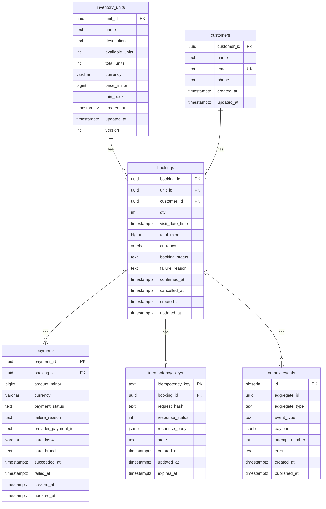

# ADR-001: Data Model for Booking and Payment

## Status

Accepted — 2026-09-01

## Context

Loka is a booking engine for perishable inventory (rooms, cabins, seats). The
primary design constraint is **correctness under concurrent contention**:
multiple requests routinely compete for the last unit of the same inventory row.
Throughput matters, but never at the cost of selling something twice.

Two properties of the deployment shape every decision below:

1. **The service runs as multiple replicas.** In-process synchronisation
   (`sync.Mutex`) protects memory inside one process. With three replicas behind
   a load balancer, each holds its own mutex guarding its own memory, and none
   is aware of the others. Every invariant that matters must therefore be
   enforced somewhere all replicas share — which is Postgres.

2. **Application code will have bugs.** A prior experiment in `internal/lab`
   demonstrated this concretely: an unsynchronised in-memory inventory of 10
   seats, under 500 concurrent booking attempts, confirmed 34 bookings and left
   its own ledger inconsistent (`available = -4`, `sold = 25`, summing to 21
   rather than 10). The database should refuse to persist such a state
   regardless of what the application layer does.

## Data Model



Note: the `bookings → outbox_events` relationship is shown for clarity but is
**not** enforced by a foreign key. See Decision 6.

---

## Decision 1 — Availability is a mutable counter

`inventory_units` stores both `total_units` (immutable capacity) and
`available_units` (decremented on each confirmed booking).

**Alternatives considered:**

- **Derive availability** by counting confirmed bookings
  (`SELECT count(*) FROM bookings WHERE unit_id = ? AND booking_status = 'confirmed'`).
  Availability becomes impossible to corrupt, because it is computed rather than
  stored. Rejected because availability is read on every search and every
  booking attempt; an aggregate over a growing `bookings` table on the hottest
  read path is the wrong trade. It also makes the "last seat" check a scan
  rather than a single-row read.

- **Store only `available_units`.** Rejected: without `total_units` there is no
  reference point, so drift is undetectable and the constraint in Decision 2
  cannot be expressed.

**Chosen:** store both. Reads are a single indexed row lookup. The cost is a
mutable counter that can drift — which is precisely why Decision 2 exists.

**Accepted consequence:** a single inventory row becomes a contention point
under load. Days 8–10 measure exactly how much, across four concurrency-control
strategies.

---

## Decision 2 — Invariants are enforced by the database, not the application

Every invariant that can be expressed as a constraint is expressed as one. The
application is treated as untrusted.

| Invariant | Mechanism |
|---|---|
| Availability can never go negative or exceed capacity | `CHECK (available_units >= 0 AND available_units <= total_units)` |
| A booking can never be charged twice | Partial unique index on `payments (booking_id) WHERE payment_status = 'succeeded'` |
| A retried request cannot create a second booking | `idempotency_key` as primary key; insert-first claims the request |
| A booking cannot hold an invalid status | `CHECK (booking_status IN ('pending','confirmed','cancelled'))` |
| A booking cannot be both confirmed and cancelled | `CHECK (NOT (confirmed_at IS NOT NULL AND cancelled_at IS NOT NULL))` |

The partial unique index deserves particular note. A plain
`UNIQUE (booking_id)` on `payments` would be wrong: payment attempts legitimately
repeat after a decline or timeout, and that history is worth keeping. What must
be unique is the *successful* attempt. Postgres supports uniqueness over a
subset of rows:

```sql
CREATE UNIQUE INDEX idx_payments_one_success_per_booking
ON payments (booking_id)
WHERE payment_status = 'succeeded';
```

Many failed attempts are permitted; a second success is rejected by the storage
engine, regardless of which replica issued it or what bug shipped.

The same mechanism serves the outbox relay, for a different purpose:

```sql
CREATE INDEX idx_outbox_unpublished
ON outbox_events (id)
WHERE published_at IS NULL;
```

The relay polls for unpublished events continuously. A conventional index on
`published_at` would index millions of published rows that are never queried.
The partial index contains only pending rows, and a row leaves it automatically
once published — so the index stays small permanently while the table grows
without bound.

---

## Decision 3 — Money is `bigint` in minor units, with an explicit currency

All monetary amounts are stored as `bigint` counts of the smallest currency unit,
alongside a `varchar(3)` ISO currency code.

**Alternatives considered:**

- **Floating point.** Rejected outright. Binary floating point cannot represent
  0.1 exactly; sums drift, and reconciliation against a payment provider becomes
  impossible.
- **`numeric` / `decimal`.** Exact, and therefore correct, but arbitrary-precision
  arithmetic is slower and the scale is ambiguous at the schema level.

**Chosen:** `bigint` minor units. Exact, fast, unambiguous, and the industry
default. Column names carry the unit (`price_minor`, `total_minor`,
`amount_minor`) so the representation is obvious at the call site.

`payments` stores its own `amount_minor` rather than referencing
`bookings.total_minor`. These legitimately diverge — partial payments, refunds,
post-hoc amendments to a booking — and a financial record should be
self-contained enough to reconcile against a provider statement without a join.
Where they *should* agree, storing both allows the equality to be asserted; the
Week 4 chaos test does exactly that.

---

## Decision 4 — Optimistic concurrency control via a `version` column

`inventory_units` carries a `version integer`, incremented on every update.
Writes take the form:

```sql
UPDATE inventory_units
SET available_units = available_units - $1, version = version + 1
WHERE unit_id = $2 AND version = $3;
```

Zero rows affected means another transaction won the race; the caller retries
with fresh state.

**Alternative:** pessimistic locking via `SELECT ... FOR UPDATE`, which is
simpler and never retries, but serialises all contenders for the duration of the
transaction.

**Chosen:** both are implemented, because the point of this project is to
measure the difference rather than assert it.

**Hypothesis to be tested (Days 8–10):** optimistic locking wins at low
contention, where retries are rare and lock-waiting is pure overhead; pessimistic
locking wins at high contention, where the retry rate makes optimistic writes
waste more work than waiting would have cost. `SERIALIZABLE` isolation is
measured as a third data point. This is a hypothesis, not a finding — the
benchmark table in `docs/metrics.md` will record what actually happens.

---

## Decision 5 — Customer details are referenced, not copied

`bookings` holds a `customer_id` foreign key rather than duplicating name, email,
and phone onto each booking.

**Accepted consequence, and it is a real one:** if a customer updates their email
address, every historical booking now displays the new address. Invoices,
receipts, and shipping records conventionally *copy* contact details for exactly
this reason — a historical record should reflect what was true when it was
created, not what is true now.

**Chosen anyway** because Loka's bookings are operational records rather than
legal financial documents; a single source of truth for contact details is more
useful for support and for sending updates about an upcoming visit. If Loka later
needs to issue invoices, a `booking_contact_snapshot` table capturing details at
confirmation time would be added rather than changing this decision.

`customers.email` is unique. This assumes one account per email address, which
holds for a signup-first flow. A guest-checkout flow that creates customers
implicitly would collide on repeat customers; that flow would need to look up by
email before inserting.

---

## Decision 6 — The outbox is a generic, unenforced log

`outbox_events` identifies its subject with an `aggregate_type` / `aggregate_id`
pair rather than a typed foreign key such as `booking_id`.

**Rationale:**

- **One table serves every aggregate.** Bookings today; payments, refunds, and
  inventory changes without a schema change.
- **No foreign key, deliberately.** The outbox is an append-only log of things
  that were announced. A `BookingDeleted` event must be publishable even though
  the booking row no longer exists, and deleting a booking must not cascade into
  deleting the record that it was once announced.

`id` is `bigserial` rather than a UUID, because the relay must publish in
creation order and a random UUID does not sort. Note that `bigserial` values are
assigned at `INSERT` time, not at commit time, so two concurrent transactions can
commit out of ID order. A relay tracking a high-water mark would therefore skip
events permanently. This is avoided by marking rows published individually
(`published_at`) rather than tracking a cursor, combined with
`FOR UPDATE SKIP LOCKED` when multiple relay instances run.

---

## Consequences

**Made easier:**

- Overbooking, double-charging, and duplicate request processing are prevented by
  the storage layer and cannot be reintroduced by an application bug or a new
  replica.
- The booking write path is a single-row read plus a single-row update — cheap,
  and easy to reason about under load.
- Events and business state commit atomically, so the outbox pattern in Week 3
  has somewhere to land with no schema change.

**Made harder:**

- A popular inventory unit is a single hot row. Horizontal scaling of the
  application does not scale writes to that row.
- The `available_units` counter must be kept correct by discipline plus
  constraints; the derived alternative would have been correct by construction.
- Constraint violations surface as database errors that the application must
  translate into meaningful HTTP responses rather than as clean domain errors.

**Would revisit at 100× scale:**

- Sharding hot inventory into per-unit sub-rows to spread contention, at the cost
  of a more complex availability read.
- Moving reservation into a short-lived hold (Redis or a `holds` table with a TTL)
  so payment latency does not hold a database lock.
- Change-data-capture (Debezium) replacing the polling relay, removing the poll
  interval from end-to-end event latency.
- Partitioning `outbox_events` and `idempotency_keys` by time, so expiry is a
  partition drop rather than a delete.